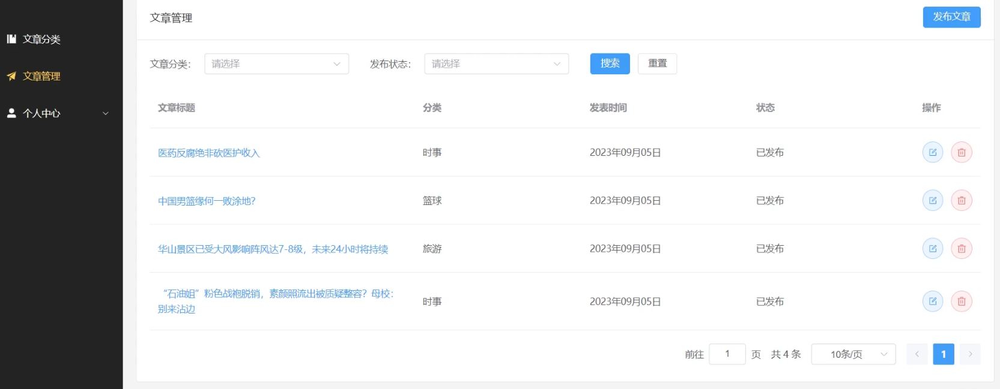

### Project Summary: Backend Development for a News Sharing and Viewing Platform

#### Project Overview
This project is a backend application focused on enabling users to share and view trending news. Developed using Java Spring Boot 3 and Maven, the system is designed to provide a platform where users can publish, browse, and manage trending news articles. The project integrates various technologies to enhance performance and scalability.

#### Technologies and Tools
- **Java**: The primary programming language, offering robust object-oriented support and a wide range of enterprise development tools.
- **Spring Boot 3**: Simplifies configuration and development processes, improving overall development efficiency.
- **Maven**: Manages project dependencies, automates builds, and handles version control.
- **Redis**: Employed for caching to improve data retrieval performance and reduce database load.
- **JWT (JSON Web Token)**: Used for user authentication and authorization, ensuring system security.
- **ThreadLocal**: Utilized to store thread-local variables in a multi-threaded environment, ensuring data isolation.
- **Cloud Services**: Integrated for managing file uploads, providing efficient and secure file storage.
- **Project Deployment**: Completed project deployment, ensuring stable operation and service provision.

#### Core Features
1. **User Management**
   - **User Registration**: Provides an interface for new user registration, including data validation and storage.
   - **User Login**: Implements user login, where users authenticate with a username and password, generating a JWT token.
   - **User Information Update**: Supports updating user information, avatars, and password changes.
   - **JWT Authentication and Authorization**: Secures user authentication with JWT and validates requests via interceptors.
   - **ThreadLocal Data Storage**: Uses ThreadLocal to store relevant information about the currently logged-in user for easy access across modules.

2. **Article Category Management**
   - **Add Article Categories**: Allows administrators to add new article categories, facilitating news organization and management.
   - **Query Article Categories**: Provides various query interfaces, supporting conditional retrieval of article categories.
   - **Update Article Categories**: Supports updating existing article categories to keep system data up-to-date.

3. **Article Management**
   - **Add Articles**: Enables users to publish new articles and store relevant information in the database.
   - **Article Query and Pagination**: Supports conditional article queries and provides pagination features to optimize query performance.
   - **Update and Delete Articles**: Supports updating and deleting articles, ensuring content is kept current and managed effectively.

4. **System Optimization and Expansion**
   - **Redis Caching**: Utilized Redis as a caching layer, significantly improving system response times and reducing database load.
   - **File Upload Management**: Managed file uploads via cloud services, providing a secure and stable solution for file storage.

#### Development Process
- The project began with requirement analysis, identifying three main modules: users, article categories, and articles.
- Spring Boot 3 was used to quickly set up the project framework, with Maven managing dependencies and the build process.
- Core features such as user authentication and authorization, article category management, and CRUD operations for articles were implemented incrementally.
- Redis was integrated to optimize performance, particularly for caching, leading to improved system responsiveness.
- Finally, the system was deployed, ensuring it could run reliably in a production environment.

### 项目总结：基于用户分享和查看热点新闻的后端开发项目

#### 项目概述
该项目是一个基于用户分享热点新闻和查看热点新闻的后端应用，采用了 Java Spring Boot 3 和 Maven 进行开发。整个系统旨在为用户提供一个平台，用户可以在平台上发布、浏览和管理热点新闻。项目中整合了多个技术栈，提升了系统的性能和扩展性。

#### 技术栈与工具
- **Java**: 作为主要开发语言，提供了良好的面向对象支持和广泛的企业级应用开发工具。
- **Spring Boot 3**: 采用 Spring Boot 框架，简化了项目的配置和开发过程，提升了开发效率。
- **Maven**: 通过 Maven 管理项目依赖，构建自动化以及项目的版本控制。
- **Redis**: 利用 Redis 进行缓存优化，提升了数据的读取性能，减少了数据库的压力。
- **JWT（JSON Web Token）**: 用于用户认证与授权，保证了系统的安全性。
- **ThreadLocal**: 在多线程环境下，使用 ThreadLocal 存储线程的局部变量，解决了数据隔离问题。
- **云服务**: 集成了云服务来管理文件上传，确保了文件的高效、安全存储。
- **项目部署**: 完成了项目的整体部署，确保系统能够稳定运行并提供服务。

#### 核心功能
1. **用户相关功能**
   - **用户注册**: 提供新用户注册接口，支持数据校验与用户信息存储。
   - **用户登录**: 实现了用户登录功能，用户凭借用户名和密码进行认证，生成 JWT Token。
   - **用户信息更新**: 支持用户更新个人信息、头像以及修改密码。
   - **JWT 认证与授权**: 通过 JWT 实现安全的用户认证机制，并利用拦截器对请求进行安全验证。
   - **ThreadLocal 数据存储**: 使用 ThreadLocal 存储当前登录用户的相关信息，方便在不同模块中访问。

2. **文章分类相关功能**
   - **新增文章分类**: 允许管理员添加新的文章分类，便于新闻内容的组织与管理。
   - **查询文章分类**: 提供多种查询接口，支持按条件检索文章分类信息。
   - **更新文章分类**: 支持更新现有的文章分类信息，保持系统数据的时效性。

3. **文章管理功能**
   - **新增文章**: 允许用户发布新文章，并存储相关信息到数据库。
   - **文章查询与分页**: 支持按条件查询文章内容，并提供分页功能，优化查询性能。
   - **文章更新与删除**: 支持文章的更新与删除操作，确保内容的及时更新与管理。

4. **系统优化与扩展**
   - **Redis 缓存优化**: 利用 Redis 作为缓存层，提升了系统的响应速度，并减轻了数据库负载。
   - **文件上传管理**: 通过云服务管理文件上传，提供安全、稳定的文件存储解决方案。

#### 开发流程
- 项目初期，进行了需求分析，确定了用户、文章分类、文章三个主要模块。
- 采用 Spring Boot 3 快速搭建项目框架，利用 Maven 管理依赖和构建流程。
- 开发过程中，逐步实现了用户认证与授权、文章分类管理、文章的增删查改等核心功能。
- 针对性能瓶颈，集成了 Redis 进行缓存优化，显著提升了系统的响应速度。
- 最后，完成了系统的部署，保证项目可以在生产环境中稳定运行。
